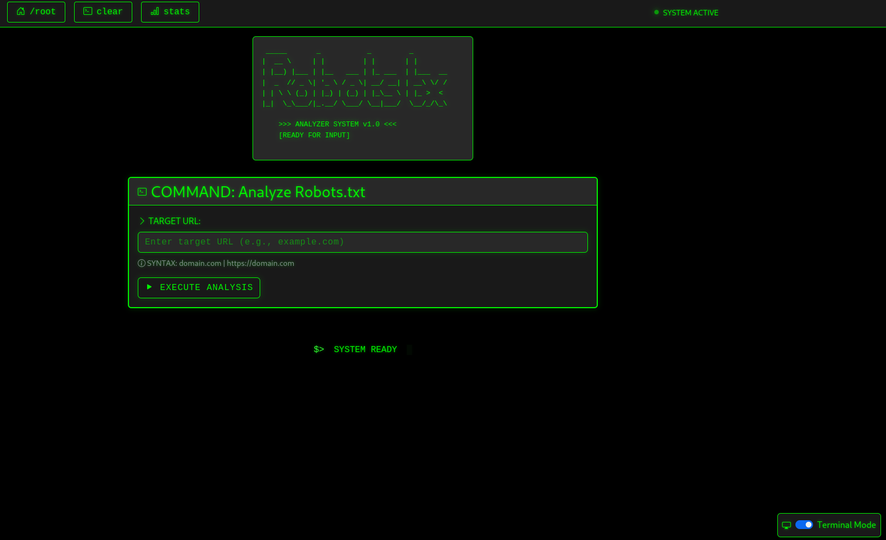
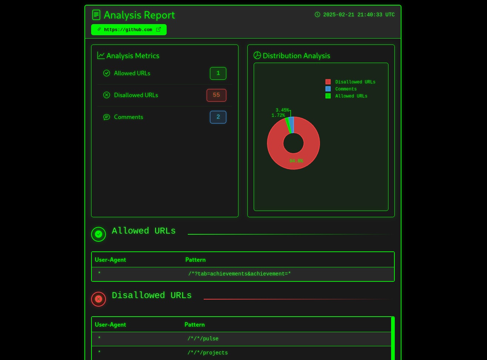
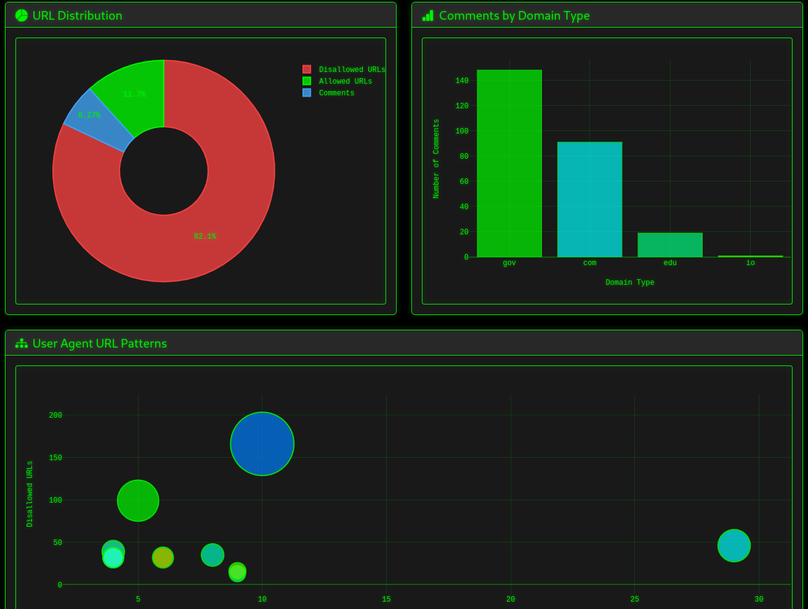

# Robots.txt Analyzer

A terminal-themed web application that scans and analyzes robots.txt files from websites and provides detailed insights about their structure and content. Features a modern, responsive interface inspired by terminal aesthetics.

## Media






## Features

- Fetches and parses robots.txt files from any website
- Real-time analysis with loading animations
- Interactive data visualizations:
  - Dynamic donut chart showing URL distribution
  - Bar chart showing comments by domain type (.com, .net, etc.)
  - Interactive scatter plot of user agent patterns
  - Color-coded metrics with terminal theme styling
- Global statistics:
  - Total and average counts per domain
  - Most common allowed and disallowed directories
  - Most common comments with frequency analysis
  - User agent categorization and pattern analysis
  - Latest analyzed domains with pagination
- Terminal-themed UI elements:
  - Monospace fonts and green-on-black color scheme
  - Animated loading indicators
  - Glowing effects and subtle animations
  - Responsive layout that works on all devices
- Persistent storage using SQLite database
- Clean and efficient codebase using modern web technologies

## Tech Stack

### Backend
- FastAPI - Modern, fast web framework
- SQLAlchemy - SQL toolkit and ORM
- Uvicorn - Lightning-fast ASGI server

### Frontend
- HTMX - Modern JavaScript-free interactivity
- Bootstrap 5 - Responsive UI framework
- Plotly.js - Interactive data visualizations:
  * Donut charts for distribution analysis
  * Bar charts for domain statistics
  * Scatter plots for user agent patterns
- Custom CSS animations and terminal theme effects

### Data & Templates
- SQLite - Lightweight, serverless database
- Jinja2 - Fast, expressive templating
- Requests - HTTP library for fetching robots.txt files

## Installation

1. Clone the repository:
```bash
git clone <repository-url>
cd robots_analyzer
```

2. Create and activate a virtual environment:
```bash
# Create virtual environment
python -m venv venv

# Activate on Windows
venv\Scripts\activate

# Activate on Unix/MacOS
source venv/bin/activate
```

3. Install dependencies:
```bash
pip install -r requirements.txt
```

## Running the Application

### Development Mode
Run the application with auto-reload for development:
```bash
uvicorn app.main:app --reload --host 0.0.0.0 --port 8000
```

### Production Mode
For production deployment:
```bash
uvicorn app.main:app --host 0.0.0.0 --port 8000
```

The application will be available at `http://localhost:8000`

## Docker-Compose

```bash
docker-compose up -d
```

Navigate to `http://localhost:8080` once docker-compose finishes building the containers.

### Environment Variables
No environment variables are required for basic operation. The SQLite database will be created automatically in the project root directory.

### Browser Support
The application works best in modern browsers with support for:
- CSS Grid and Flexbox
- CSS Custom Properties (CSS Variables)
- Modern JavaScript (ES6+)
- WebSocket connections (for HTMX)

## Project Structure

```
robots_analyzer/
├── app/
│   ├── __init__.py
│   ├── main.py          # FastAPI application and routes
│   ├── database.py      # Database configuration and session
│   └── models.py        # SQLAlchemy models for analysis data
├── templates/
│   ├── base.html        # Base template with terminal theme
│   ├── index.html       # Home page with command interface
│   ├── analysis.html    # Individual analysis results
│   └── stats.html       # Global statistics and visualizations
├── static/             # Static assets directory (optional)
├── requirements.txt    # Project dependencies
└── README.md          # Documentation
```

## Usage Guide

### Basic Analysis
1. Access the application at `http://localhost:8080`
2. Enter a domain in the TARGET URL field (e.g., "example.com")
3. Click "EXECUTE ANALYSIS" or press Enter
4. View the comprehensive analysis results

### Analysis Results
The results are presented in two main views:

1. **Individual Analysis**
   - Detailed metrics for the analyzed domain
   - Interactive donut chart of URL distribution
   - Allowed and disallowed URL patterns
   - Original comments with syntax highlighting
   - Terminal-style presentation

2. **Global Statistics** (accessible via `/stats`)
   - Overview of all analyzed domains:
     * Total counts and averages per domain
     * Distribution of URLs across all domains
     * Comments by domain type (.com, .net, etc.)
   - Pattern Analysis:
     * Most common allowed/disallowed directories
     * User agent behavior visualization
     * Comment frequency and length statistics
   - Historical Data:
     * Latest analyzed domains
     * Paginated results
     * Quick access to previous analyses

### Data Storage
- Analysis results are automatically stored in SQLite
- Database file: `robots_analysis.db`
- No manual configuration needed
- Results persist between sessions

### Performance Notes
- Analysis typically completes in 1-2 seconds
- Large robots.txt files may take longer
- Real-time progress indicator shows status
- Responsive even during analysis